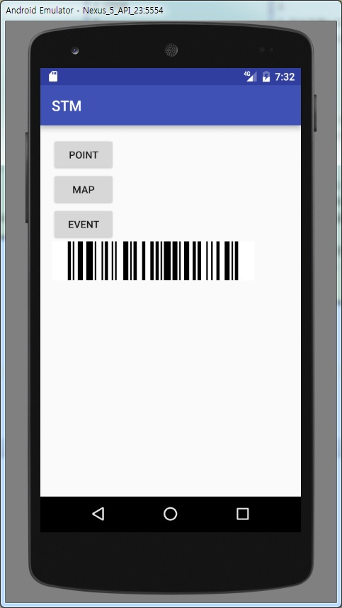
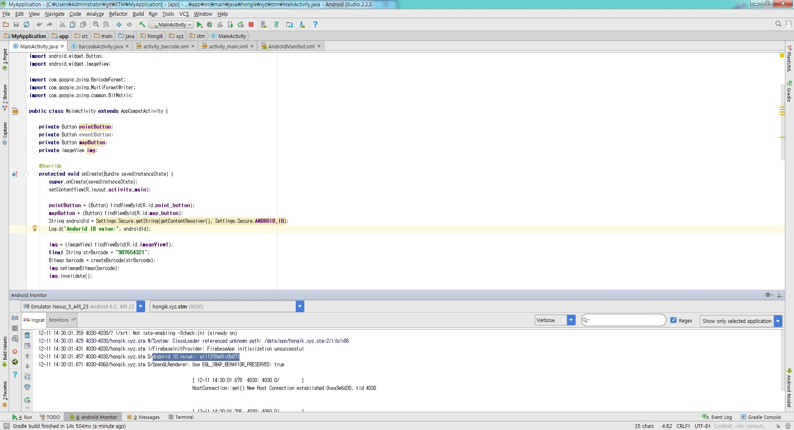
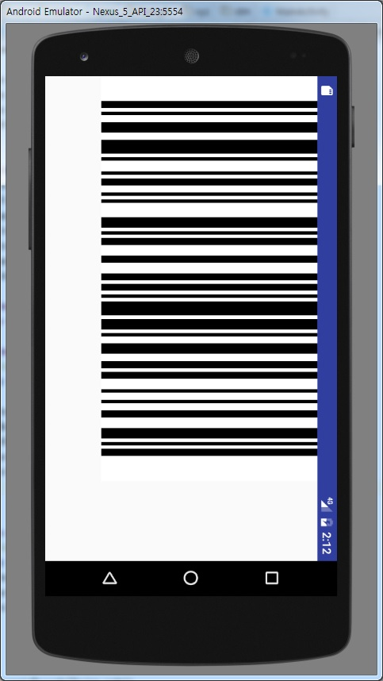

#Sangmin Lee scrum

###16.11.22
1. 바코드 라이브러리 검색 - zxing library code128
2. 쿠폰, 바코드 카드, 도장 등 다양한 형태 사용에 대한 의견 제시됨 - 바코드로 잠정적 결정
3. 가격, 판매처, 적용 가능성 등 조사해오기

###16.11.29
1. 잠정적으로 바코드를 사용하기로 했으므로, 가격, 판매처, 적용 가능성은 조사하지 않았다. zxing library 사용법에 대해서 조사했다.
2. -
3. 고유한 바코드 번호 생성 방법 연구

##### [zxing 사용 관련 링크][zxing_use]
[zxing_use]: http://fallingstar.tistory.com/151
##### [android 고유 기기 번호 얻는법][unique_android_id]
[unique_android_id]: http://blog.daum.net/creazier/15310297

###16.12.06
1. 바코드 생성 완료
2. 포인트 사용, 적립 내역 저장방법 생각해보기
3. 안드로이드 고유 기계 번호를 사용하여 바코드 생성해보기

바코드 생성 결과 

###16.12.13
1. 안드로이드 고유 기계 번호를 사용하여 바코드 생성 완료, Intent시 화면 회전 완료
2. 포인트 사용, 적립 내역 저장방법 생각해보기 이어서
3. 바코드 위치 조정, 다른 팀 합류

안드로이드 고유번호 

회전 모습 

